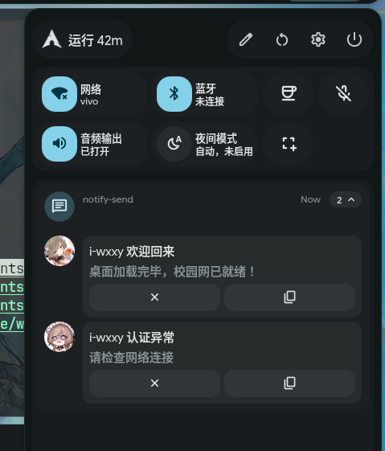

# AutoLoginToSchoolWIFI
~~（对shell脚本chmod +x 因该不用我说吧）~~

设计的是在每使用NetworkManager连i-wxxy的时候执行一次登陆请求，然后是在进去桌面系统的时候执行一次登陆请求

hyprland桌面就把`hypr-exec.sh` 加到`exec-once`里

kde,gnome桌面就看`install.sh` 的最后注释的一部分，通过desktop开机自启

利用NetworkManager 的联网事件写的后台自动登陆校园网上网的

在10.1.99.100连接校园网时F12我们可以发现会发出http请求,我们观察选择不同运营商时的请求，便可以提取出来请求中都有哪些需要我们填的变量

然后我们写个脚本（进行http请求）利用NetworkManager 的联网事件就可以达到自动登陆校园网的功能啦



| 项目             | 无锡学院    | 中国移动      | 中国联通        | 中国电信         |
| -------------- | ------- | --------- | ----------- | ------------ |
| `login_method` | `1`     | `1`       | `1`         | `1`          |
| `,0,`          | 固定      | 固定        | 固定          | 固定           |
| user_account   | `学号`    | `学号@cmcc` | `学号@unicom` | `学号@telecom` |
| user_password  | 校园网密码   | 校园网密码     | 校园网密码       | 校园网密码        |
| 注销接口           | 相同      | 相同        | 相同          | 相同           |
| logout         | `drcom` | `drcom`   | `drcom`     | `drcom`      |
| MAC_unbind     | 相同      | 相同        | 相同          | 相同           |

```http
wxxy_login:  
http://10.1.99.100:801/eportal/portal/login?callback=dr1003&login_method=1&user_account=%2C0%2C学号&user_password=密码&wlan_user_ip=10.2.73.232&wlan_user_ipv6=&wlan_user_mac=000000000000&wlan_ac_ip=&wlan_ac_name=&jsVersion=4.1.3&terminal_type=1&lang=zh-cn&v=5962&lang=zh
wxxy_logout: 
http://10.1.99.100:801/eportal/portal/logout?callback=dr1003&login_method=1&user_account=drcom&user_password=123&ac_logout=1&register_mode=1&wlan_user_ip=10.2.73.232&wlan_user_ipv6=&wlan_vlan_id=1&wlan_user_mac=000000000000&wlan_ac_ip=&wlan_ac_name=&jsVersion=4.1.3&v=4152&lang=zh

wxxy_unbind: 
http://10.1.99.100:801/eportal/portal/mac/unbind?callback=dr1002&user_account=学号&wlan_user_mac=000000000000&wlan_user_ip=当前ip转化为10进制后的数字&jsVersion=4.1.3&v=4946&lang=zh

联通_login:  
http://10.1.99.100:801/eportal/portal/login?callback=dr1003&login_method=1&user_account=%2C0%2C学号%40unicom&user_password=密码&wlan_user_ip=10.2.73.232&wlan_user_ipv6=&wlan_user_mac=000000000000&wlan_ac_ip=&wlan_ac_name=&jsVersion=4.1.3&terminal_type=1&lang=zh-cn&v=6137&lang=zh

电信_login: 
http://10.1.99.100:801/eportal/portal/login?callback=dr1003&login_method=1&user_account=%2C0%2C学号%40telecom&user_password=密码&wlan_user_ip=10.2.73.232&wlan_user_ipv6=&wlan_user_mac=000000000000&wlan_ac_ip=&wlan_ac_name=&jsVersion=4.1.3&terminal_type=1&lang=zh-cn&v=6279&lang=zh


移动_login: 
http://10.1.99.100:801/eportal/portal/login?callback=dr1003&login_method=1&user_account=%2C0%2C学号%40cmcc&user_password=密码&wlan_user_ip=10.2.73.232&wlan_user_ipv6=&wlan_user_mac=000000000000&wlan_ac_ip=&wlan_ac_name=&jsVersion=4.1.3&terminal_type=1&lang=zh-cn&v=6462&lang=zh
移动_unbind: 
http://10.1.99.100:801/eportal/portal/mac/unbind?callback=dr1002&user_account=学号&wlan_user_mac=000000000000&wlan_user_ip=当前ip转化为10进制后的数字&jsVersion=4.1.3&v=4959&lang=zh
移动_logout:
http://10.1.99.100:801/eportal/portal/logout?callback=dr1004&login_method=1&user_account=drcom&user_password=123&ac_logout=1&register_mode=1&wlan_user_ip=10.2.73.232&wlan_user_ipv6=&wlan_vlan_id=1&wlan_user_mac=000000000000&wlan_ac_ip=&wlan_ac_name=&jsVersion=4.1.3&v=1026&lang=zh
```
